# Ingest Real-Time Data with Eventstream in Microsoft Fabric

This repository contains the steps to ingest, transform, and route real-time events using the Eventstream feature in Microsoft Fabric. This exercise focuses on capturing and analyzing data from a sample bike-share system.

## Introduction

Microsoft Fabric's Eventstream feature is designed to capture, transform, and route real-time events to various destinations. This guide will walk you through an exercise to ingest data from a sample data source that emits a stream of events related to observations of bicycle collection points in a bike-share system within a city.

**Approximate Lab Duration:** 30 minutes

## Prerequisites

* A [Microsoft Fabric tenant](https://app.fabric.microsoft.com/home?experience=fabric) is required to complete this exercise.

## Getting Started

Follow these steps to set up your real-time data ingestion solution using Eventstream in Microsoft Fabric.

### 1. Create a Workspace

Before working with data in Fabric, you need to create a workspace with Fabric capacity enabled.

1.  Navigate to the [Microsoft Fabric home page](https://app.fabric.microsoft.com/home?experience=fabric) in your browser and sign in with your Fabric credentials.
2.  In the menu bar on the left, select **Workspaces** (the icon looks similar to 🗇).
3.  Create a **new workspace** with a name of your choice.
4.  Select a licensing mode that includes Fabric capacity (e.g., **Trial**, **Premium**, or **Fabric**).

    *When your new workspace opens, it should be empty.*

### 2. Create an Eventhouse

Now that you have a workspace, you can start creating the Fabric items you’ll need for your real-time intelligence solution. We’ll begin by creating an Eventhouse.

1.  In the workspace you just created, select **+ New item**.
2.  In the **New item** pane, select **Eventhouse**, giving it a unique name of your choice.

    *Close any tips or prompts that are displayed until you see your new empty Eventhouse.*

    *In the pane on the left, note that your Eventhouse contains a KQL database with the same name as the Eventhouse.*

3.  Select the KQL database to view it.
    *Currently there are no tables in the database. In the rest of this exercise, you’ll use an eventstream to load data from a real-time source into a table.*

### 3. Create an Eventstream

1.  In the main page of your KQL database, select **Get data**.
2.  For the data source, select **Eventstream** > **New eventstream**.
3.  Name the Eventstream `Bicycle-data`.

    *The creation of your new event stream in the workspace will be completed in just a few moments. Once established, you will be automatically redirected to the primary editor, ready to begin integrating sources into your event stream.*

### 4. Add a Source

1.  In the Eventstream canvas, select **Use sample data**.
2.  Name the source `Bicycles`, and select the **Bicycles** sample data.
    *Your stream will be mapped and you will be automatically displayed on the **eventstream canvas**.*


### 5. Add a Destination

1.  Select the **Transform events or add destination** tile and search for **Eventhouse**.
2.  In the **Eventhouse** pane, configure the following setup options:
    * **Data ingestion mode:** `Event processing before ingestion`
    * **Destination name:** `bikes-table`
    * **Workspace:** `Select the workspace you created at the beginning of this exercise`
    * **Eventhouse:** `Select your eventhouse`
    * **KQL database:** `Select your KQL database`
    * **Destination table:** `Create a new table named bikes`
    * **Input data format:** `JSON`
3.  In the **Eventhouse** pane, select **Save**.
4.  On the toolbar, select **Publish**.

    *Wait a minute or so for the data destination to become active. Then select the `bikes-table` node in the design canvas and view the **Data preview** pane underneath to see the latest data that has been ingested:*

    *Wait a few minutes and then use the **Refresh** button to refresh the **Data preview** pane. The stream is running perpetually, so new data may have been added to the table.*
    *Beneath the eventstream design canvas, view the **Data insights** tab to see details of the data events that have been captured.*

### 6. Query Captured Data

The eventstream you have created takes data from the sample source of bicycle data and loads it into the database in your eventhouse. You can analyze the captured data by querying the table in the database.

1.  In the menu bar on the left, select your KQL database.
2.  On the **database** tab, in the toolbar for your KQL database, use the **Refresh** button to refresh the view until you see the `bikes` table under the database. Then select the `bikes` table.
3.  In the **…** menu for the `bikes` table, select **Query table** > **Records ingested in the last 24 hours**.

    *In the query pane, note that the following query has been generated and run, with the results shown beneath:*

    ```kusto
    // See the most recent data - records ingested in the last 24 hours.
    bikes
    | where ingestion_time() between (now(-1d) .. now())
    ```
4.  Select the query code and run it to see 100 rows of data from the table.

### 7. Transform Event Data

The data you’ve captured is unaltered from the source. In many scenarios, you may want to transform the data in the event stream before loading it into a destination.

1.  In the menu bar on the left, select the `Bicycle-data` eventstream.
2.  On the toolbar, select **Edit** to edit the eventstream.
3.  In the **Transform events** menu, select **Group by** to add a new **Group by** node to the eventstream.
4.  Drag a connection from the output of the **Bicycle-data** node to the input of the new **Group by** node. Then use the **pencil** icon in the **Group by** node to edit it.

5.  Configure the properties of the **Group by** settings section:
    * **Operation name:** `GroupByStreet`
    * **Aggregate type:** `Select Sum`
    * **Field:** `select No_Bikes`. Then select **Add** to create the function `SUM of No_Bikes`.
    * **Group aggregations by (optional):** `Street`
    * **Time window:** `Tumbling`
    * **Duration:** `5 seconds`
    * **Offset:** `0 seconds`
    * *Note: This configuration will cause the eventstream to calculate the total number of bicycles in each street every 5 seconds.*
6.  Save the configuration and return to the eventstream canvas, where an error is indicated (because you need to store the output from the transformation somewhere!).
7.  Use the **+** icon to the right of the **GroupByStreet** node to add a new **Eventhouse** node.
8.  Configure the new Eventhouse node with the following options:
    * **Data ingestion mode:** `Event processing before ingestion`
    * **Destination name:** `bikes-by-street-table`
    * **Workspace:** `Select the workspace you created at the beginning of this exercise`
    * **Eventhouse:** `Select your eventhouse`
    * **KQL database:** `Select your KQL database`
    * **Destination table:** `Create a new table named bikes-by-street`
    * **Input data format:** `JSON`
9.  In the **Eventhouse** pane, select **Save**.
10. On the toolbar, select **Publish**.
    *Wait a minute or so for the changes to become active.*

    *In the design canvas, select the `bikes-by-street-table` node, and view the **data preview** pane beneath the canvas.*

   

    *Note that the transformed data includes the grouping field you specified (Street), the aggregation you specified (SUM_No_Bikes), and a timestamp field indicating the end of the 5 second tumbling window in which the event occurred (Window_End_Time).*

### 8. Query the Transformed Data

Now you can query the bicycle data that has been transformed and loaded into a table by your eventstream.

1.  In the menu bar on the left, select your KQL database.
2.  On the **database** tab, in the toolbar for your KQL database, use the **Refresh** button to refresh the view until you see the `bikes-by-street` table under the database.
3.  In the **…** menu for the `bikes-by-street` table, select **Query data** > **Show any 100 records**.

    *In the query pane, note that the following query is generated and run:*

    ```kusto
    ['bikes-by-street']
    | take 100
    ```
4.  Modify the KQL query to retrieve the total number of bikes per street within each 5 second window:

    ```kusto
    ['bikes-by-street']
    | summarize TotalBikes = sum(tolong(SUM_No_Bikes)) by Window_End_Time, Street
    | sort by Window_End_Time desc , Street asc
    ```
5.  Select the modified query and run it.
    *The results show the number of bikes observed in each street within each 5 second time period.*

### 9. Clean Up Resources

In this exercise, you have created an eventhouse and populated tables in its database by using an eventstream.

When you’ve finished exploring your KQL database, you can delete the workspace you created for this exercise.

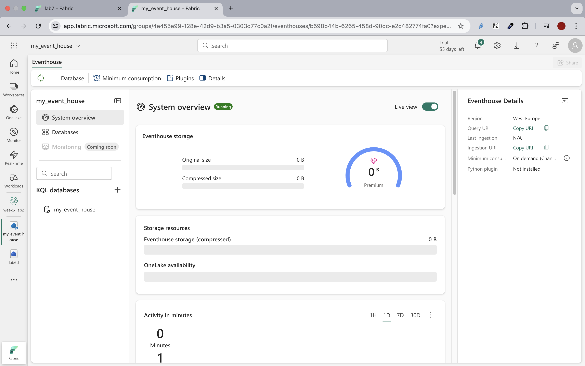
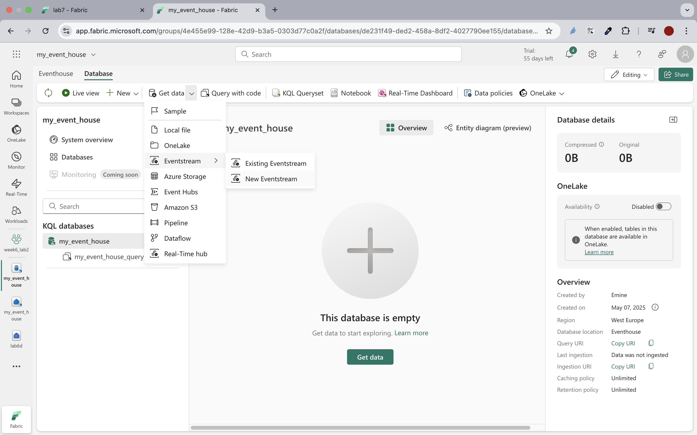
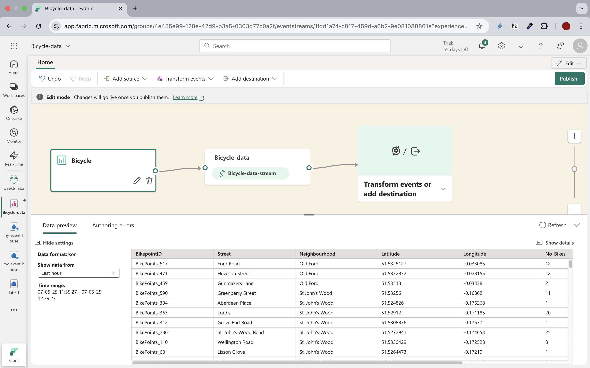
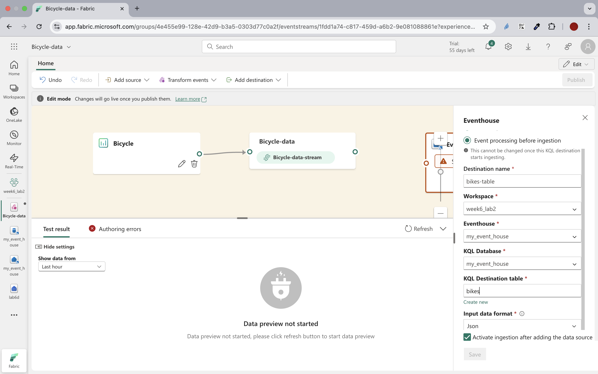
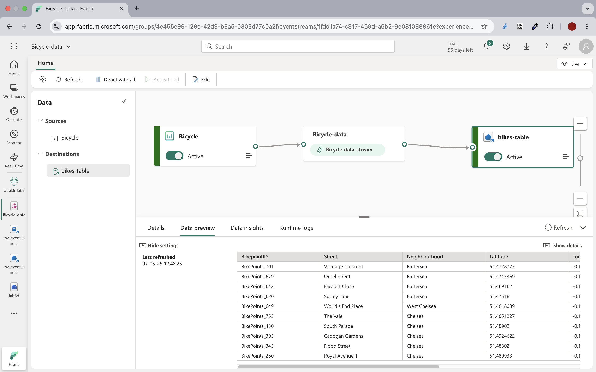
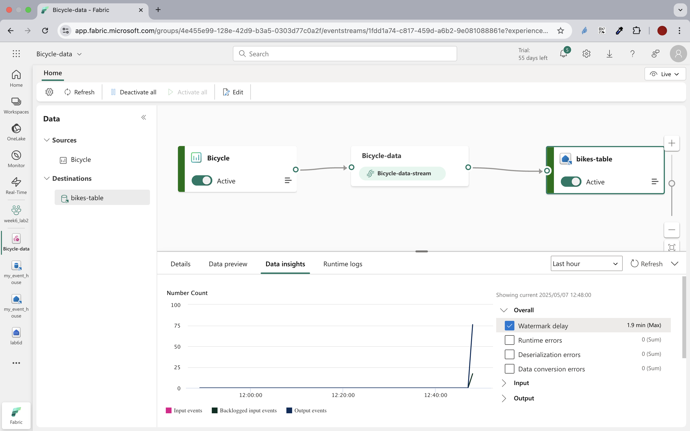
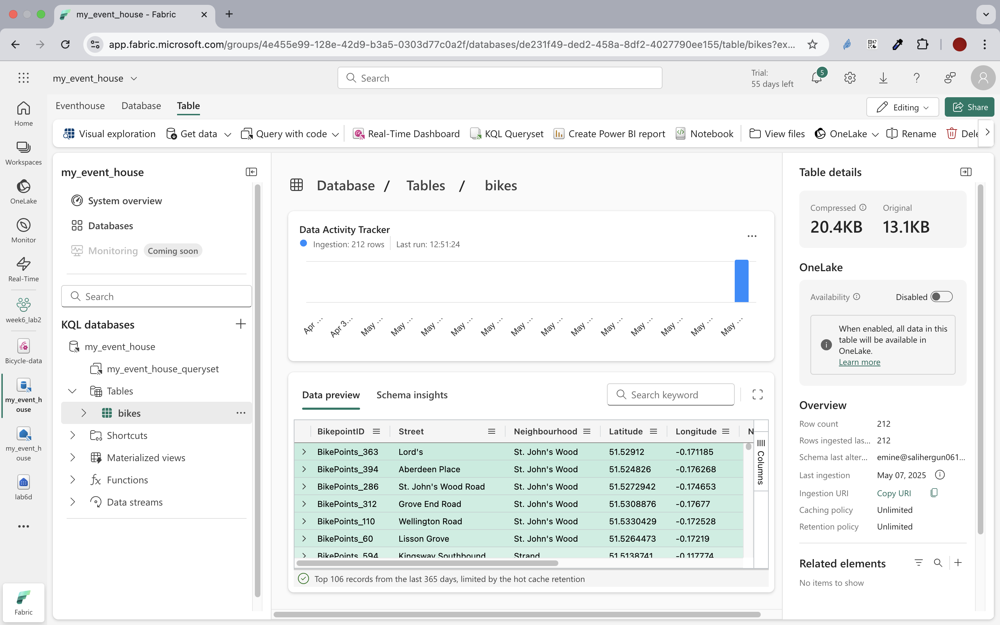
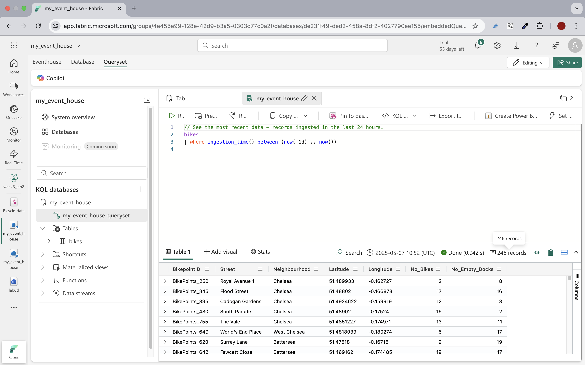
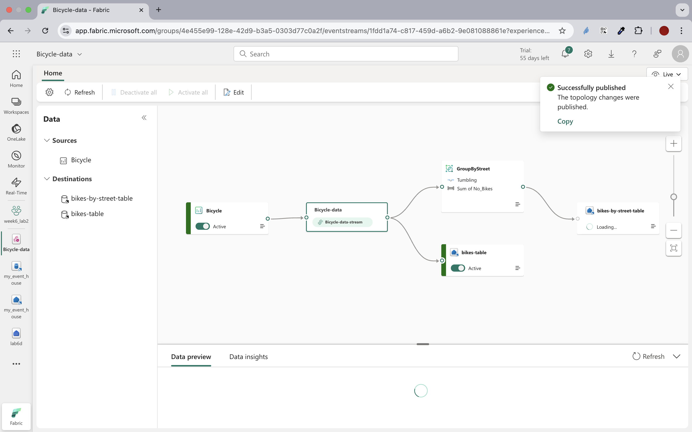
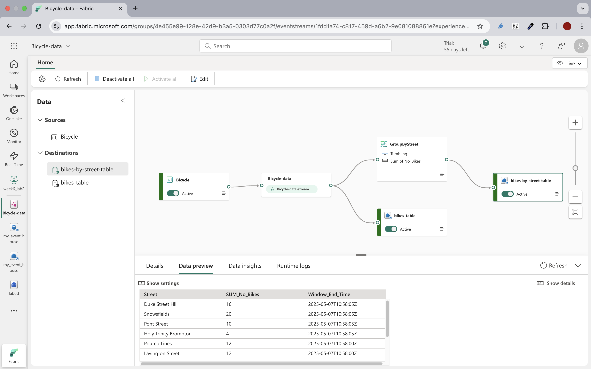
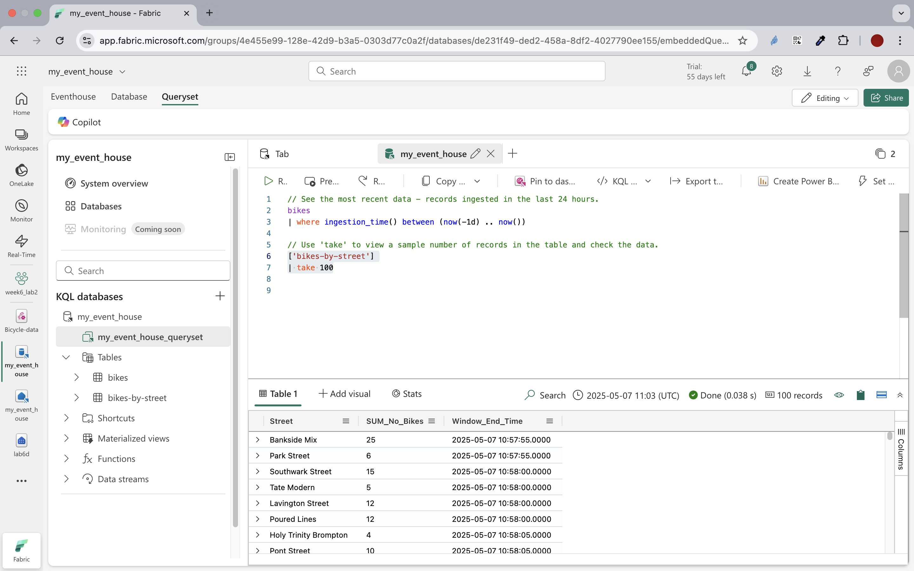
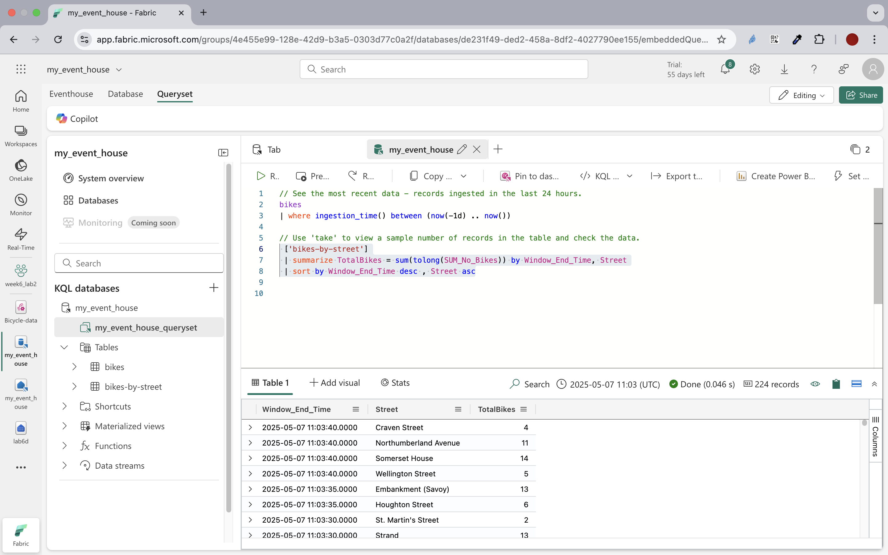


1.  In the bar on the left, select the icon for your workspace.
2.  In the toolbar, select **Workspace settings**.
3.  In the **General** section, select **Remove this workspace**.
